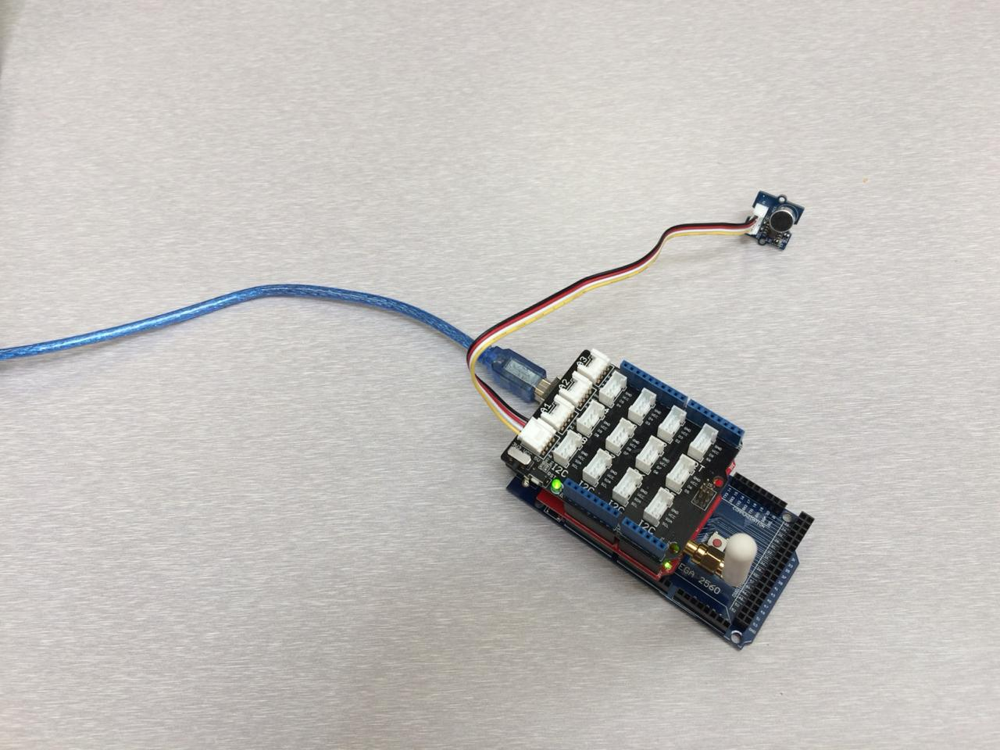
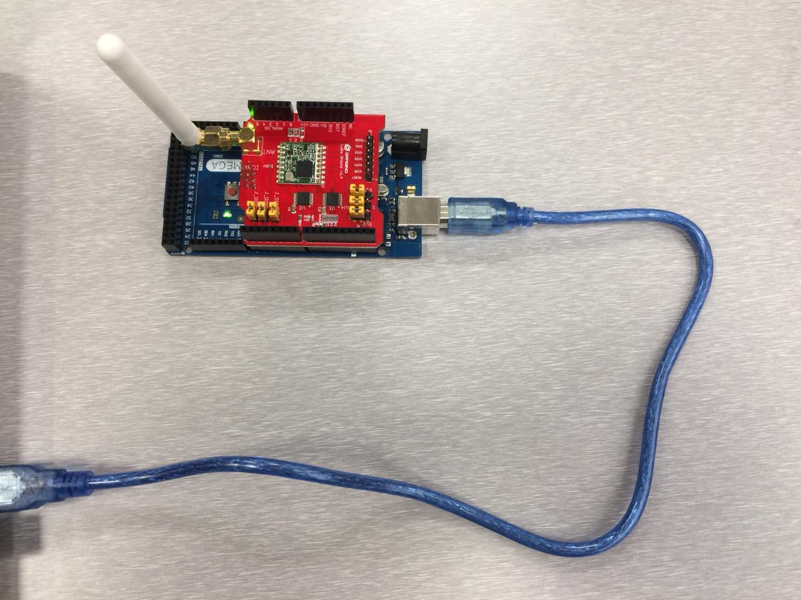
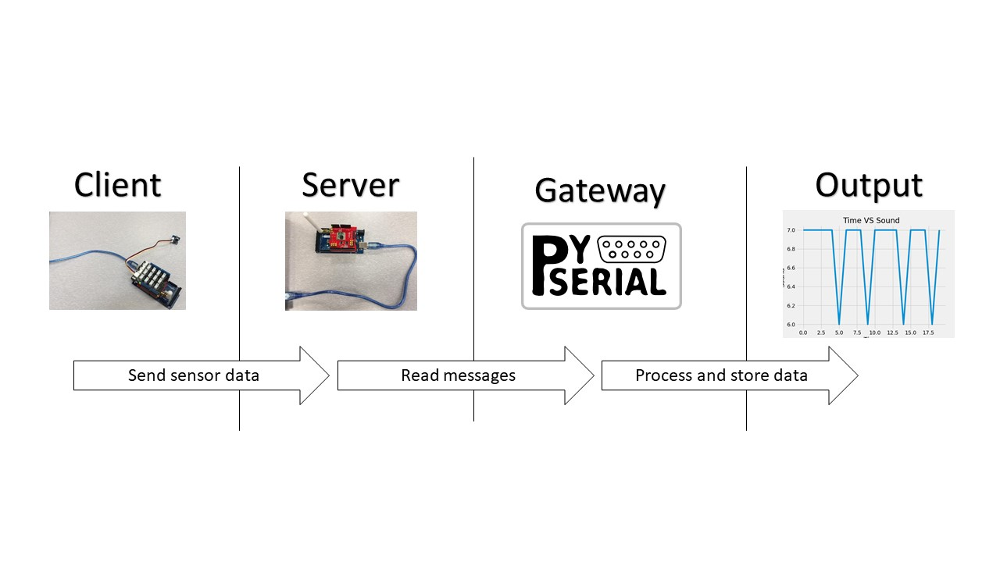
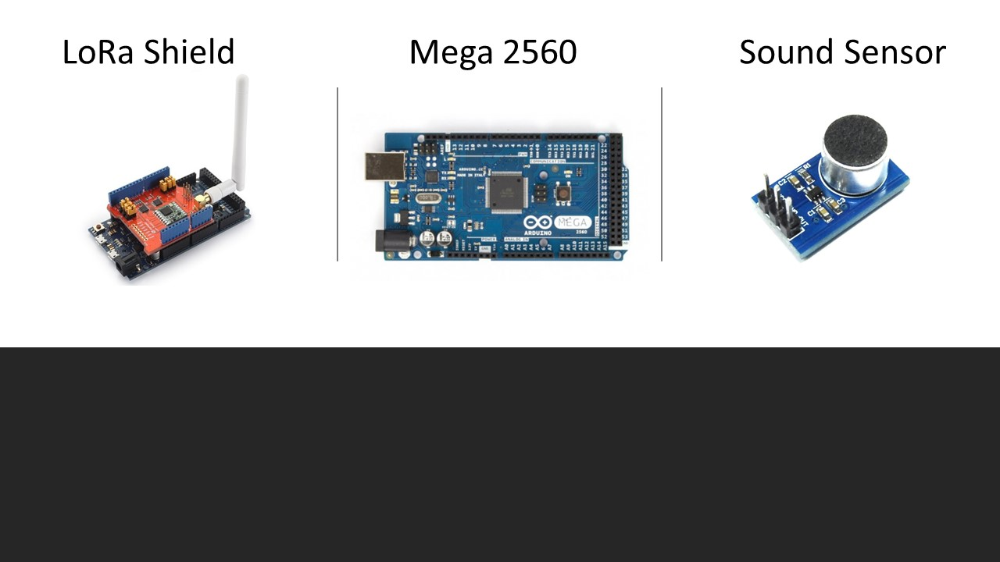

# Microphone Arduino Client-Server LoRa Connection
Simple IoT application in which microphone sensor on client side and python code on server side to process the readings of the sensor

Sender: Sound + LoRa Shield             |   Receiver: LoRa Shield 
:-------------------------:|:-------------------------:
  |  

## Basic Idea

 
- Client send microphone and vibration sensors data (JSON object) to the server via LoRa shield.
- Server (connected to PC) receives data via LoRa shield to process it later. 
- Python program acts as gateway that that receives data from LoRa interface. 
- Python program parse JSON object and stores its data in CSV file.
- Using Matplotlib, visualize sensors numerical data LIVE.

## Devices and Components Used 

## Authors 

* Abdulrhman Saad
* Mohanned Ahmed 

